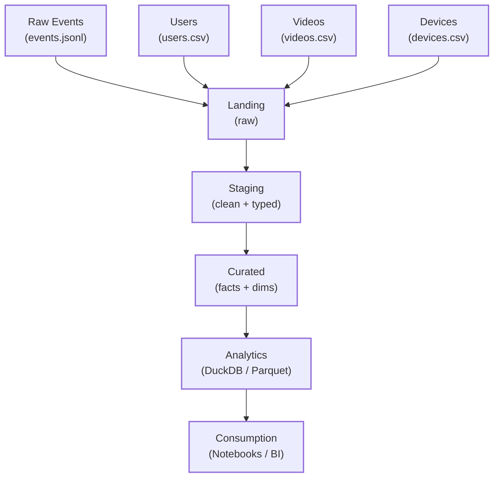
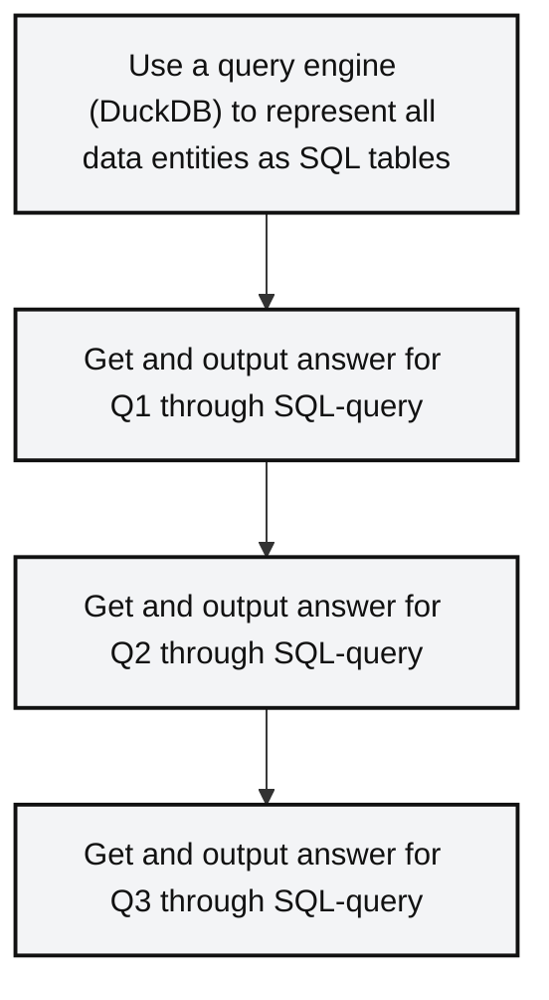

## Goal
Enable dashboards and ad-hoc analysis so Product can answer:
Enable dashboards and ad-hoc analysis so Product can answer:
- Q1: “What % of new users reach at least 30 seconds of watch_time in their first session?”
- Q2: “Which video genres drive the highest 2nd-session retention within 3 days?”
- Q3: “Is there a particular device_os or app_version where drop-off is abnormally high?”

# Data generation and pipeline experiments.
TODO

### 1) Diagram: raw JSON to staging to analytics layer

### 2) How to make JSON queryable alongside CSV dimensions
- Use a query engine (DuckDB) to represent all data entities as SQL tables
- Get and output answer for Q1 through SQL-query
- Get and output answer for Q2 through SQL-query
- Get and output answer for Q3 through SQL-query

### 3) Final table/model structure 
- Final tables structure is same as input! We could extract required data by SQL-queries 

